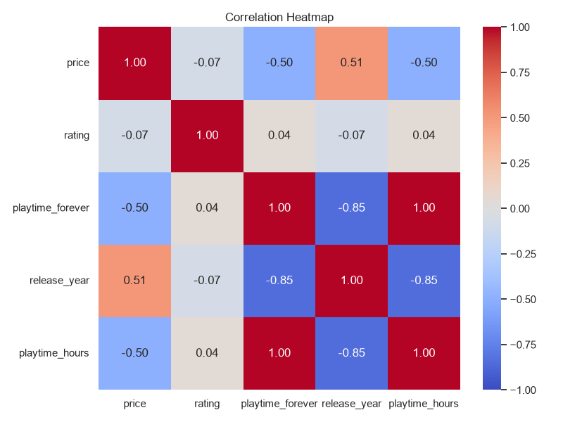
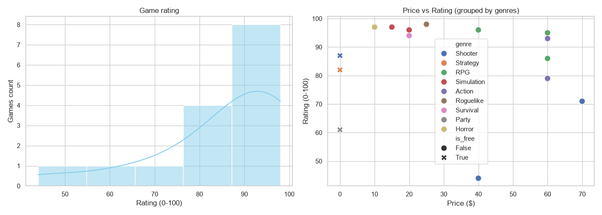

# Steam Game Recommender & Data Pipeline

A modular Python tool designed to clean Steam library data, perform Exploratory Data Analysis (EDA), and suggest similar games using a custom k-NN implementation built from scratch with NumPy.

## 🚀 Features

* **Data Pipeline (Pandas):** Ingests raw JSON data, extracts metrics (playtime in hours, pricing flags), handles data aggregation, and exports cleaned CSVs.
* **Custom k-NN Engine (NumPy):** Vectorized feature matrix extraction with Min-Max scaling and Euclidean distance calculations without explicit Python loops.
* **Exploratory Data Analysis (Seaborn/Matplotlib):** Automated generation of rating distribution, scatter plots, and feature correlation heatmaps.

## 📊 Visualizations (EDA)

### Feature Correlation Heatmap


### Rating Distribution & Price Analysis


## 🛠️ How to Run

1. **Activate virtual environment:**
   ```bash
   source venv/bin/activate  # or .\venv\Scripts\Activate.ps1 on Windows
2. **Install dependencies:**
   ```bash
   pip install pandas numpy matplotlib seaborn
3. **Run DataPipeline & Visualizations:**
   ```bash
   python data_pipeline.py
   python eda_visualization.py